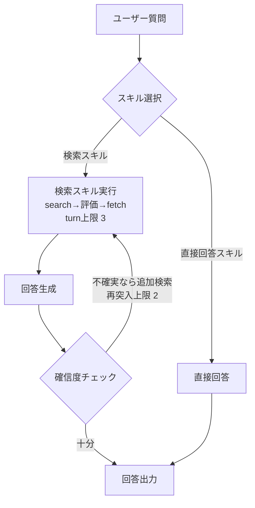
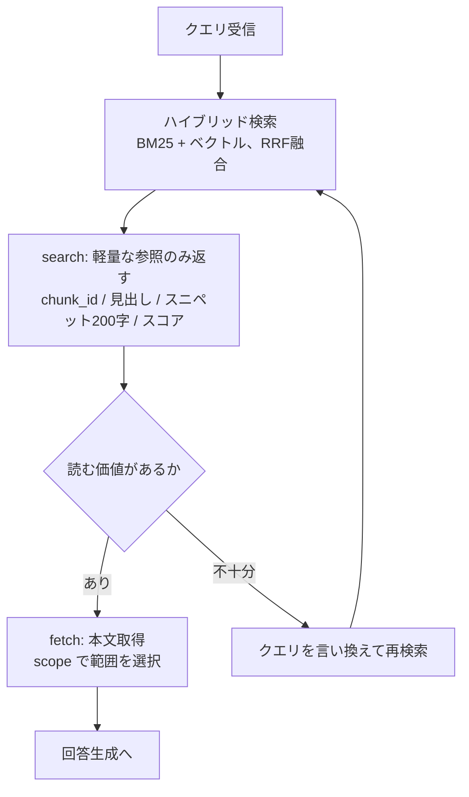

# エージェント的RAG設計メモ

検索要否の判定を「スキル選択」に一本化したエージェント的RAGの設計と、
それを普通のRAGと比較するための実験構成。

これは**現在の最終設計**を書く生きたドキュメント。判断に至った経緯は `decisions/` に
追い出してあるので、変更の理由を知りたい場合はそちらを参照。

- 意思決定の記録 → [`decisions/`](decisions/)
- search/fetch の詳細 → [`search-fetch.md`](search-fetch.md)
- 比較実験の設計 → [`comparison-experiment.md`](comparison-experiment.md)
- 技術スタック → [`tech-stack.md`](tech-stack.md)

## 全体方針

検索が必要かどうかの判定を独立したステップとして持たず、**スキル選択自体に判定を
兼ねさせる**。直接回答も1つのスキルとして候補に含めることで、判定ロジックを
スキルの description（トリガー条件）に集約する。→ [`0001`](decisions/0001-skill-based-routing.md)

## 全体フロー



turn 上限と確信度チェックの再突入上限は**独立した2つの安全装置**として併用する。
前者は無限ループの防止、後者は事前判定の取りこぼしのリカバー。

## スキルの description 設計

判定ロジックはコードではなくこの2つのテキストに集約されている
（実体は `src/skills/descriptions.ts`）。

### 検索スキル

> 文書・記録・仕様・数値・日付・固有名称など、具体的な情報源を参照した方が正確に
> 答えられる可能性がある質問に対して使用する。特定の専門用語や固有名詞を含む質問、
> 「〜によると」「根拠を示して」といった出典を求める質問、バージョン間の比較、
> 更新・改訂される可能性のある情報への言及がある質問はすべて対象。文書に基づく必要が
> あるか判断に迷う場合は、直接回答ではなくこちらを優先する。

### 直接回答スキル

> 会話メタ発言（「さっきの回答について」「言い換えて」など）、挨拶・雑談、事実の正確性に
> 依存しない意見・ブレインストーミング、特定の文書やデータセットを参照しない一般的な
> 推論・計算、ユーザーが明示的に「仮の話」「一般論として」と前置きしている質問にのみ使用する。
> 質問に具体的な用語・固有名詞・数値など、文書に存在しうる情報が少しでも含まれる場合は
> このスキルを使わず、検索スキルに委ねること。

### 設計のポイント

1. **非対称性を明文化** — 検索側は「迷ったらこちら」、直接回答側は「少しでも疑わしければ
   使わない」と、両方から同じ方向にバイアスをかけている
2. **具体的なトリガー語彙を列挙** — 実際の質問文に出てきそうな語（「根拠を示して」等）を含める
3. **否定条件は直接回答側にのみ書く** — 判定の揺れを常に検索側に吸収させる
4. **日本語で統一** — ユーザーの質問文と同じ言語空間で判断させ、表層一致の手がかりを活かす

description を変更したら `skill-selection-accuracy` を測り直すこと。ここは実験対象そのもの。

## 検索要否は完璧には判定できない、という前提

LLM が自身の知識境界を正確に自己申告することは原理的に困難（calibration 問題）。
完璧な事前判定を目指すのではなく「**間違えたときのコストが小さくなるように設計する**」方針を取る。

失敗のコストは非対称である。

| 失敗 | 帰結 | コスト |
|---|---|---|
| 要検索なのに直接回答（取りこぼし） | 誤情報を自信をもって答える | **高** |
| 不要なのに検索（過剰発火） | レイテンシとトークンが余分にかかる | 低 |

したがって迷ったら検索側に倒し、確信度チェックを保険として後段に置く。
評価は正解率ではなく**検索スキルの Precision / Recall を分けて**見る
（設計が効いていれば Recall > Precision になるはず）。

## 検索スキルの内部



- **search は本文を返さない。** 返すとエージェントがスニペットだけで判断し、分離した意味が消える
- **fetch の scope をエージェントが選ぶ** — `chunk_only` / `with_neighbors` / `whole_section`。
  「どこまで読むか」の判断がエージェント的RAGの中核 → [`0003`](decisions/0003-search-fetch-separation.md)
- **Cross-Encoder リランクは入れない。** 比較の変数を増やさないため → [`0005`](decisions/0005-no-cross-encoder-rerank.md)
- RRF は順位の統計的融合であって、リランクとは別物

詳細は [`search-fetch.md`](search-fetch.md)。

## インデックス構築（ingestion）

整形・ノイズ除去は **fetch 時ではなくインデックス構築時に一度だけ**行う。
embedding と BM25 のインデックスがノイズ入りテキストに対して作られるのを避けるため。
→ [`0004`](decisions/0004-cleaning-at-ingestion.md)

```
Qiita API → clean → chunk（見出し境界） → embed → LanceDB
```

チャンクは見出しで切り、`heading_path`（例: `記事タイトル > セットアップ > Docker`）を
メタデータとして持たせる。これが (a) スニペットの文脈補強、(b) fetch の範囲拡張の
両方で使われる。

### 日本語で必ず踏む地雷

LanceDB の全文検索はデフォルトの `baseTokenizer: "simple"` だと日本語をほぼ分割できず、
**BM25 が機能しない**（実測で実コーパス16%）。`"icu"` を明示すること。
→ [`0007`](decisions/0007-japanese-fts-tokenizer.md)

`npm run verify-fts` が検証ゲートになっている。

## 比較実験

3パターンが**同一のLanceDBインデックス・同一チャンク分割・同一生成モデル・同一生成プロンプト**を
共有し、検索戦略とループの有無だけを変数にする。

1. **ナイーブRAG** — ベクトル top-5、単発
2. **ハイブリッド** — BM25＋ベクトル（RRF融合）top-5、単発
3. **エージェント的RAG** — スキル選択 + search/fetch ループ

golden set は `easy`（単発で引ける対照群）と `multihop`（複数チャンクの統合が必要）に
分かれている。**easy は単発検索が天井に張り付くため、そこだけ見てもエージェント化の
効果は測れない。** 詳細は [`comparison-experiment.md`](comparison-experiment.md)。

## 次のステップ候補

- 実験ログの定性観察をもとに、turn 上限や description を調整して再実験する
- `FTS_TOKENIZER=ngram` で再構築し、retrieval-recall が改善するか比較する（`0007` の宿題）
- ロジックが固まったらローカルLLM（vLLM / llama.cpp）に差し替えて挙動の違いを比較する
- 8失敗モードタキソノミー（別プロジェクト）に「スキル選択の誤り」を追加できないか検討する
