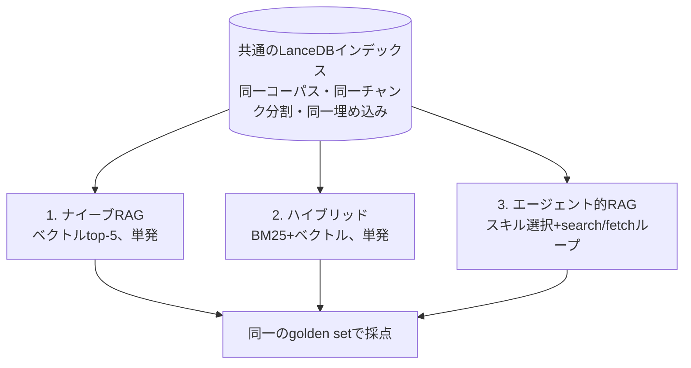

## TL;DR

- 自分のQiita記事20本をコーパスに、**ナイーブRAG / ハイブリッド検索 / エージェント的RAG** の3パターンを同一条件で比較した
- 初回は**完敗**（multihop 10/26）。原因を追うと**5つが実装バグと計測の交絡**で、潰したら単発ハイブリッドと同点（17/26）まで上がった
- 「引き分けなら十分では」で終わらせず、**クエリ分解**と**検索候補の記事多様化**という2つの工夫を追加した
- ところが最初の統合方法が**異なるクエリのスコアを直接比較する設計ミス**で、同点から一度**さらに悪化**した（14/26）
- 統合方法を「実績のある候補を無条件で守る」方式に直したら、最終的に**19/26でハイブリッドの17/26を上回った**。
  ただし**入力トークンは約27倍・レイテンシは約9倍**を払っている
- **「エージェント的RAGは効果がない/ある」と結論する前に何を確認すべきか**が、この記事の本題

## 対象読者

- RAGにエージェント的なループを入れるか迷っている人
- 日本語コーパスでRAGを組もうとしている人
- LLMを使った比較実験を、それらしい数字で終わらせたくない人

---

## なぜ3パターンに分けたか

「普通のRAGとエージェント的RAGを比較したい」という動機だったが、2択にすると
**改善したときにその原因が分からない**。エージェント化で良くなったのか、
検索器を良くしたから良くなったのか切り分けられない。

そこで3つに分けた。

| # | パターン | 検索 | ループ |
|---|---|---|---|
| 1 | ナイーブRAG | ベクトル top-5 | なし |
| 2 | ハイブリッド | BM25 + ベクトル（RRF融合）top-5 | なし |
| 3 | エージェント的RAG | ハイブリッド + スキル選択 + search/fetch ループ | あり |

- **1 → 2 の差** = 検索精度の改善による効果
- **2 → 3 の差** = エージェント化による効果（検索器は同一なので、差はループと判断のみ）



比較を成立させるため、以下を不変条件として固定した。

1. 3パターンは**同一のLanceDBインデックス**を共有する
2. **生成モデルとプロンプトは共通**（1箇所に定義して全パターンがimportする）
3. 埋め込みモデルは ingestion と検索で同一
4. 最終的にプロンプトへ入る根拠は **k=5 が上限**
5. 3パターンとも同一形状の結果を返す

構成は TypeScript + [Mastra](https://mastra.ai/)、ベクトルDBは LanceDB、
LLMと埋め込みは OpenAI（`gpt-5.6-luna` / `text-embedding-3-large`）。

---

## 結果

golden set 46問（後述）に対する完全ヒット率。これは記事の最後にたどり着いた最終状態の数字で、
そこに至るまでの紆余曲折はこのあと順番に書く。

| | easy | multihop | 入力トークン | レイテンシ |
|---|---|---|---|---|
| ナイーブRAG | 19/20 | 13/26 | 1,591 | 2.8s |
| ハイブリッド | **20/20** | 17/26 | 1,620 | 3.0s |
| **エージェント的RAG** | 19/20 | **19/26** | **44,264** | **28.3s** |

- **1 → 2**（検索精度の改善）: multihop 13 → 17。**ハイブリッド検索は明確に効いた**
- **2 → 3**（エージェント化）: 17 → 19。**精度は上がったが、コストは約27倍**

単発で足りる easy 領域では、ここまでの全実行を通じてエージェント的RAGが単発を上回ったことは
**一度もなかった**。差がついたのはすべて multihop（複数チャンクの統合が必要な質問）で、
これは設計上の狙い通りである。

ただしこの結果に一直線でたどり着いたわけではない。初回は multihop **10/26** の完敗で、
そこから2段階の作業を経ている。

1. **5つの実装バグ・計測の交絡を潰す** → 単発ハイブリッドと同点（17/26）
2. **検索の工夫を2つ足す** → 一度さらに悪化（14/26）→ 原因を直して最終的に上回る（19/26）

まず1段階目から書く。

---

## 本題：その結論を出す前に潰すべきだった5つのこと

初回の結果は multihop **10/26** だった。単発ハイブリッドの17に対して完敗である。
そこから17まで上がったのだが、**7問ぶんの改善はすべて実装バグと計測の交絡の除去**で、
新機能は1つも足していない。

| 実行 | multihop | 変更内容 |
|---|---|---|
| (a) | 10/26 | ベースライン |
| (b) | 14/26 | k=5 という予算の存在をエージェントに伝えた |
| (c) | 12/26 | 充足チェックを収集段階へ（マージ順にバグ混入） |
| (d) | 10/26 | マージ順を修正 |
| (e) | 16/26 | 1手目を元の質問に固定 + 言い換え方針 + 計測バグ修正 |
| (f) | 17/25 | スニペット 200 → 500字 |

以下、順に説明する。

### 落とし穴1: 日本語BM25がデフォルト設定で死んでいる

これは実験を始める前に踏んだ。

LanceDB の全文検索は Tantivy ベースで、`baseTokenizer` のデフォルトは `simple`。
これは**空白と句読点で分割する**トークナイザなので、分かち書きしない日本語では
BM25 が機能しない。

合成データと実コーパスで測った。

| baseTokenizer | 合成データ | 実コーパス（記事20本） |
|---|---|---|
| `simple`（デフォルト） | **0/10 (0%)** | **4/25 (16%)** |
| `icu` | 10/10 | 23/25 (92%) |
| `ngram` (2-3) | 10/10 | 25/25 (100%) |

合成データで**全クエリがヒット0件**。実コーパスで16%まで上がるのは、
`LanceDB` `vLLM` のようなASCII語だけは空白区切りでもトークン化されるから。
つまり**日本語語彙はほぼ引けていない**。

```ts
await table.createIndex("text", {
  config: lancedb.Index.fts({ baseTokenizer: "icu" }),  // 明示が必須
});
```

厄介なのは**エラーも警告も出ない**こと。検索結果が空になるだけなので、
最終スコアを見ても原因に辿り着けない。デフォルトのまま進めていたら、
パターン2のBM25側の寄与はゼロで、「ハイブリッド検索は効果がない」という
誤った結論に着地していた。

`icu` を採用した（`ngram` は100%だが、これは「部分文字列検索が部分文字列を見つけた」という
ほぼ同語反復で、ランキング品質の証拠にはならないため）。

### 落とし穴2: LLMに作らせたgolden setは簡単すぎて天井に張り付く

評価用の質問セットを、各チャンクをLLMに渡して自動生成した。
正解 chunk_id が生成時点で自動的に紐づくのが利点である。

60問作って、生成を走らせず検索だけ測ったところ——

| | recall@5 |
|---|---|
| ベクトル検索 | 58/60 (97%) |
| ハイブリッド | **60/60 (100%)** |

**単発検索が満点**。これでは、エージェント化に改善の余地が構造的に存在しない。
このまま実験を回せば「ループはコストが増えるだけ」という結論が出るが、
それは*エージェント的RAGについての発見ではなく、golden setが簡単すぎることの反映*である。

原因ははっきりしている。**1つのチャンクから質問を作り、かつ主題を名指しさせた**ため、
その1チャンクと語彙・意味の両方がほぼ完全一致していた。

そこで**マルチホップ質問**を追加した。別記事にある2つのチャンクを組み合わせないと
答えられない質問である。ベクトル近傍を「別記事から」引いてペアを作り、
両方が必要な質問をLLMに作らせる。

| バケット | ベクトル | ハイブリッド |
|---|---|---|
| easy（1チャンク） | 95% | 100% |
| **multihop（2チャンク必須）** | 50% | **65%** |

multihop に35%の伸びしろができた。ここがエージェント化の主戦場になる。

なお、**検索でヒットするかどうかで質問を絞り込んではいけない**。
評価対象の検索器で評価データを選別することになり、全パターンのスコアが
実力以上に嵩上げされる（循環論法）。フィルタは質問文の性質だけを見る。

### 落とし穴3: エージェントに「予算」を伝えていなかった

k=5（プロンプトに入る根拠は最大5件）はコードで強制していたが、
**エージェントには伝えていなかった**。

結果、46問中33問で予算を使い切っていなかった（取得件数の分布は 1件×11, 2件×11, 3件×7,
4件×4, 5件×13）。単発パターンが常に5件取るのに対し、エージェントは1〜2件で切り上げる。

**recall@5 という網羅性の指標に対して、土俵が揃っていなかった。**
実際、ハイブリッドが正解しエージェントが外した15問のうち、**12問（80%）は取得5件未満**だった。

プロンプトに「回答生成に渡せる根拠は最大5件。満たない場合は枠が余ったまま進む」と
書き足しただけで、multihop は 10/26 → 14/26 に上がった。

興味深いのは、**平均取得件数は 2.93 → 3.17 とほとんど増えていない**こと。
件数が増えたから当たったのではなく、**取りに行く対象の選び方が変わった**。

エージェントに与える情報は、能力ではなく「自分が置かれた状況の理解」を変える。
実装上の制約を知らないままだと、エージェント単体では最適でも系全体では最適でない
判断をしてしまう。

### 落とし穴4: 片方のパターンだけが使う機能が、採点対象から漏れていた

これが一番たちが悪かった。

search/fetch を分離した設計で、fetch には「どこまで読むか」を選ぶ `scope` がある。

- `chunk_only` … そのチャンクのみ
- `with_neighbors` … 前後1チャンクを含む
- `whole_section` … 同じ見出しのセクション全体

問題は採点側。`retrieved_chunk_ids` に**fetch の起点チャンクしか記録していなかった**。

```ts
// バグ: 範囲拡張で実際に読んだ隣接チャンクが計上されない
retrieved_chunk_ids: docs.map((d) => d.chunk_id),
```

範囲拡張はエージェント的RAGだけが使う機能なので、
**エージェント側だけを一方的に減点していた**。

実例。「データ拡張手法をすべて挙げよ」という質問で、エージェントの回答は
「ランダム左右反転 / RandAugment / Cutout」と完全に正解だった。
しかし fetch の起点が `#4`、golden が `#3` だったため**不正解と採点**されていた。
`with_neighbors` で `#3` も本文として読んでいたのに、記録から漏れていたのである。

比較実験では、**片方のパターンだけが使う機能が採点対象から漏れていないか**を疑うこと。

### 落とし穴5: 確信度チェックを回答の「後」に置くとループが働かない

エージェント的RAGの肝は「根拠が足りなければ検索し直す」ループである。
ところが**ターン数の中央値が1**で、46問中25問が1回の検索で完結していた。
再検索という機能が事実上使われていない。

原因は確信度チェックの位置だった。当初は回答生成の**後**に置いていたのだが、
**一度回答文が生成されると、その流暢さが根拠の不足を覆い隠す**。
片方の文書しか取れていなくても、文章としては尤もらしく仕上がるため「十分」と判定される。

そこでチェックを**収集段階**に移し、**判定器に回答文を渡さない**ようにした。
質問と、集まった根拠と、これまでに試したクエリだけを見せる。

```
検索スキル
  ├─ search→fetch ループ
  ├─ 充足チェック（根拠のみを見る。回答文は渡さない）
  └─ 不足なら「何が足りないか」を添えて再収集
→ 回答生成
```

これでループは回るようになった（ターン数 1.9 → 2.9）。
「もう片方の文書が足りない」と言えるのは、回答文ではなく**根拠そのもの**を
見ているときだけである。

---

## 損失がどこで起きているかを測る

「エージェント化はコストが増えるだけ」と結論する前に、**どこで負けているのか**を測った。

エージェントは実際に投げたクエリをログに残しているので、損失を3段階に分解できる。
生成を走らせず埋め込みだけなので、**数十秒・ほぼ無料**で回る。

| 段階 | 修正前 | 修正後 |
|---|---|---|
| ① 元の質問そのまま @5（＝単発と同条件） | 80% | 80% |
| ② エージェントの言い換えクエリ @5 | 63% | 76% |
| ③ 同 @8（エージェントが実際に見た候補） | 76% | **82%** |
| ④ 実際に fetch した根拠（最終結果） | 67% | **80%** |

| 損失 | 修正前 | 修正後 |
|---|---|---|
| A. クエリ言い換えで失った | 4件 | **0件** |
| B. 見えていたのに取らなかった | 7件 | **4件** |

### 損失A: クエリの言い換えが検索を悪くしていた

エージェントは元の質問を捨て、同義語・関連語を**継ぎ足した**クエリを作っていた。

> 元:「vLLMのmax-model-lenを小さくすると速度が改善するのはなぜ？」
> 言い換え:「vLLM max-model-len を小さくすると推論速度が改善する理由 KV cache メモリ 使用量 スケジューリング 長いコンテキスト」

語の水増しは BM25 では一致度を薄め、ベクトルでは「質問文の意味」を「語の羅列」に変質させる。
**①80% → ②63% と、17ポイントも落ちていた。**

「クエリ整形は検索を良くする」という設計時の前提が、実測では成立していなかった。

対策は2つ。

1. **1ターン目の検索をコード側で実行する。** エージェントに「元の質問を使え」と
   指示するのではなく、元の質問での検索結果を渡した状態から開始する。
   言い換えは「1回目で足りなかったとき」の手段として2ターン目以降に回す
2. **言い換えは「足す」ではなく「置き換える」**とプロンプトに明記する。
   元の質問と同じ長さかそれ以下の、別の言い方の文にさせる

結果、損失Aは**0件**になり、クエリ長も「105字 → 105字」と水増しが止まった。

### 損失B: 200字のスニペットでは判断できない

search は本文を返さず200字のスニペットだけを返す設計だった。
エージェントがスニペットだけで回答を組み立ててしまうのを防ぐためである。

しかしこれが裏目に出て、**候補リストに正解が見えているのに fetch しない**ケースが7件あった。

```
正解chunkの順位:      1, 2, 3, 6, 6, 6, 6
そのとき取得した件数: 1, 1, 5, 3, 3, 5, 5
```

**3件は1〜3位に表示されていたのに取っていない**（うち2件は1件だけ取って打ち切り）。
200字では「この文書が本当に質問に答えているか」を判断できない。

スニペットを500字に厚くしたところ、損失Bは 7件 → **4件**に減った。

### その結果

最終的に、**エージェントが見ている候補は82%で、単発ハイブリッドの80%を上回った**。
検索そのものは、もうエージェント側の方が良い。
最終結果80%も単発と同水準である。

つまり**「エージェント化で情報を失っている」状態ではなくなった**。
修正前は4つの決定点すべてが正味マイナスだったが、
最後は検索で少し勝ち、選択で少し負けて差し引きゼロ、という状態である。

---

## 引き分けの先: 工夫を2つ足したら、また負けた

引き分け（17/25 vs 17/26）で終わらせてもよかった。だが上の損失分解で、
**残り4問の負けは共通して「質問文からは複数記事にまたがる構成だと読み取れない」**
という性質を持っていることが分かっていた。これは潰せる余地に見えた。

### 工夫1: 複合質問をクエリに分解する

「AではX、BではYですか」のように**表層で対象が分離できる**複合質問は、
対象ごとに分けて検索した方が両方拾いやすいはずである。LLMに1回判定させ、
複合なら最大2つのサブクエリに分解し、元の質問と並行して検索する。

### 工夫2: 検索候補が1記事に偏っていたら、別記事を足す

このコーパスの multihop 質問は「自己完結した自然な1文」になるよう意図的に
生成しており（表層のヒントを残さない設計）、工夫1が発火しない質問も多い。
そこで検索側でも対称的な手を打った。**種検索の上位候補がほぼ1記事に偏っていたら、
その記事を除外してもう一度検索し、別記事の候補を混ぜる。**

### そして、また負けた

2つとも実装し、素朴に「複数クエリの検索結果をスコア順に統合して上位8件に切る」
方式で回したところ、**multihop が 17/26 → 14/26 相当まで悪化した**。
引き分けからさらに後退である。

1問掘り下げて原因が分かった。

> 質問:「Amazon Bedrock APIを呼び出す際、AWS CLIの`aws login`によるローカル認証では
> 何を追加インストールする必要があり、Amazon CognitoはNext.jsのAIチャットアプリで
> 認証に関してどのような機能を提供しますか？」

| | 検索したクエリ | 結果 |
|---|---|---|
| 修正前（分解あり・素朴な統合） | 元の質問 + サブクエリ2本 | **不正解**（正解の一方が候補から消えた） |
| 参考: 分解なし（単発） | 元の質問1本のみ | 正解（2件とも上位5件に入る） |

**元の質問1本で検索すれば正解できていたのに、分解して統合した結果、不正解に転落していた。**
サブクエリ側が拾った別の（不正解の）候補が、元の質問の正解候補をスコアで押し出していた。

原因は統合方法にあった。異なるクエリの検索スコア（RRFで算出）を、
**そのまま比較可能な数値として扱っていた**。狭いサブクエリはその狭い母集団の中で
相対的に高いスコアを出しやすく、質問全体を捉えた元の質問の正解候補より
上位に来てしまうことがある。落とし穴3で見た「エージェント自作の言い換えクエリは
元の質問より検索性能が低い」という現象が、分解の副産物として形を変えてもう一度出た。

```ts
// バグ: 異なるクエリのスコアをそのまま比較して統合していた
function mergeHits(hitLists: SearchHit[][], limit: number): SearchHit[] {
  const byId = new Map<string, SearchHit>();
  for (const hits of hitLists) {
    for (const hit of hits) {
      const existing = byId.get(hit.chunk_id);
      if (!existing || hit.score > existing.score) byId.set(hit.chunk_id, hit);
    }
  }
  return [...byId.values()].sort((a, b) => b.score - a.score).slice(0, limit);
}
```

修正は、**主クエリ（元の質問）の候補を無条件で残し、補助クエリ（分解・多様化）の候補は
スコアで競合させず、重複しない分だけ追加枠として足す**方式に変えた。

```ts
// 修正: 主クエリはそのまま確定。補助クエリは重複しない分を追加枠として足すだけ
function mergeProtectingPrimary(primary: SearchHit[], supplementary: SearchHit[]): SearchHit[] {
  const seen = new Set(primary.map((h) => h.chunk_id));
  const extra = supplementary.filter((h) => !seen.has(h.chunk_id)).slice(0, MAX_SUPPLEMENTARY);
  return [...primary, ...extra];
}
```

これで multihop は **19/26** まで上がり、ハイブリッドの17/26を初めて明確に上回った。
規模を確認してから全体を回す、という手順も守った——修正後にまず9問（悪化した4問＋
まだ負けていた5問）で小さく検証し、既存の正解問題を壊していないことを確認してから
全問を回している。

### この工夫にも副作用はある

- **easy 側はヒット率こそ変わらなかったが、コストだけ乗った。** easy 質問は
  単一記事・単一トピックという golden set の設計上、上位候補がほぼ必ず1記事に
  偏るため、「別記事を足す」工夫がほぼ毎回誤発火する。最終的に fetch するかは
  エージェント判断に委ねているので精度への実害はなかったが、
  レイテンシ +56%・入力トークン +22% という無駄なコストがそのまま乗っていた
- **残り4問の負けは、これでも解決しなかった。** 3問は、別記事を除外して
  検索し直しても、その検索自体が正解チャンクを上位8件に見つけられていない。
  これは統合方法ではなく**埋め込み/BM25の検索力そのものの限界**で、
  今回の工夫の延長では解決しない別の課題として残っている

### もっとシンプルな直し方があったかもしれない

「主クエリを無条件優先する」という今回の修正は、正直かなり場当たり的である。
regression の原因を振り返ると、これは分解や多様化という**発想**が悪かったのではなく、
**複数の検索結果リストを1つに統合する方法**が悪かっただけだった。異なるクエリの
RRFスコアを生の数値として比較したのが間違いで、スコアではなく**順位**で統合していれば
（＝複数クエリ版のRRF、RAG-Fusionと呼ばれる手法に近い）、
「主クエリを特別扱いする」というルールを持ち込まなくても同じ結果に届いた可能性がある。

この比較実験では、当初から Cross-Encoder によるリランクを意図的に見送っていた
（変数を増やして比較を複雑にしないため）。ただし今回起きたのは意味的な再スコアリングの
問題ではなく、**複数クエリの結果を公平に統合する**という、リランクとは別の問題である。
これは試していない。「分解・多様化・主クエリ保護」という3点セットではなく、
「クエリ拡張＋順位ベースの統合」というもっとシンプルな1点で同じ効果が出せたかもしれない、
というのは今回のコード規模を思うと悔いが残るところである。

---

## 結論

### エージェント化はここでは精度上のメリットを生んだ。ただし確信度には留保がいる

最終結果は multihop 19/26 vs ハイブリッド17/26。数字の上では上回った。
ただし**この2問差は、自分たちが他の箇所で「誤差扱いする」と決めた閾値のすれすれ**である
（後述の「分散を測っていない」を参照）。単発計測なので、この最終スコアの差そのものを
自信を持って主張するのは慎重にすべきだと思っている。

一方で、**「素朴な統合が regression を生み、統合方法を直したら回復した」という因果**は、
狙い撃ちした9問の再検証・既存の正解問題を壊していないかのスモークテスト・全体評価という
独立した3つの確認で繰り返し同じ方向の結果が出ており、こちらは単発のブレでは説明しにくい。
**「工夫Xで勝てた」という絶対的な結論より、「統合方法の設計を間違えると簡単に負ける」
という否定的な教訓の方が確信度が高い**、というのが正直なところである。

その上でコストは**入力トークン約27倍、レイテンシ約9倍**。精度が上がった分、
決定点も増えた分、コストは以前よりむしろ悪化している。

### 決定点の数はリスクだが、非対称な保護で損失を利得に転じられる

単発ハイブリッドは**判断を一切しない**。生の質問を投げ、上位5件を機械的に渡す。決定点ゼロ。

エージェント的RAGは最終的に6つの決定点を持つ。クエリ書き換え、候補の取捨選択、読む範囲、
十分性判定、複合質問の分解、検索候補の記事多様化。**そのすべてが情報を失いうる箇所**であり、
実際に分解・多様化を足した直後は、統合方法のミスで正味マイナスに転落した。

そこから分かったのは、決定点を増やすこと自体が悪いのではなく、**新しい決定点を足すときは
既存の実績のある経路（今回で言えば元の質問1本の検索）を無条件に保護し、
追加の候補を「競合」ではなく「補完」として扱う設計にしないと、増やした分がそのまま
損失になる**ということ。複数の情報源を統合するときは、スコアの比較可能性という
暗黙の前提を疑うこと。

### 単発で足りる領域では、エージェント化は一貫してコスト増

easy バケットで agentic が hybrid を上回ったことは、ここまでの全実行を通じて一度もない。
むしろ分解・多様化を足した後は、ヒット率据え置きのままコストだけ増えた
（レイテンシ+56%・入力トークン+22%）。**これは交絡の有無に関わらず成立した唯一の
一貫した所見である。**

**「まずハイブリッド検索をちゃんと作る」ほうが、費用対効果がはるかに良い**（1→2で13→17）。
エージェント化が報われるのは、単発top-5では原理的に届かない構成（今回なら multihop）
に限られる。

---

## 正直に書いておく限界

### 分散を測っていない

各条件**1回ずつ**の実行である。エージェントは確率的に振る舞うので、
**2〜4問の差は誤差**として扱ってきた。(a) 10 → (f) 17 という7問差の方向性は信頼できるが、
最終的な「17 → 19」という2問差は、この自分で決めた閾値のぎりぎり内側にある。
**最終スコアで「勝った」と言い切るのは、本来この記事の基準に照らせば慎重であるべきだった。**

一方で、regression（17→14相当）→ 修正後の回復（→19）という**方向の反転**は、
狙い撃ちした9問の再検証・スモークテストの維持率10/10・全体評価という3つの独立した
確認で一貫して同じ向きに出ており、単発run特有のブレでは説明しにくい。
**「統合方法を直したら良くなった」という相対的な因果と、「最終的に◯対◯で勝った」という
絶対的なスコア比較は、同じ実験でも確信度が違う**——これは書いていて自分でも
最後まで意識し続けるのが難しかった区別である。

私はこれを最初に限界として認識しながら、**その後何度も、単発の結果を根拠に設計変更を重ねた**。
途中で「マージ順のバグが原因」と因果を断定したが修正しても改善しなかったこともあれば、
逆に「複数クエリのスコアをそのまま比較したのが原因」という当たりが結果的に的中したこともある。
本来は分散を測ってから改善に着手すべきで、これは今回積み残した宿題である。

### 規模とドメインが限定的

自分のQiita記事20本（vLLM・ローカルLLM・RAG構築が中心）という小規模コーパス。
数万文書規模、あるいは検索が本質的に難しいドメインでは結論が変わる可能性が高い。

### マルチホップの設計が限定的

「別記事の2チャンク」に限定している。3ホップ以上や、同一記事内の遠いセクション間などは
試していない。今回はホップ数を増やさなくても、クエリ分解と記事多様化という
**検索候補の作り方の工夫だけで届く範囲が広がった**が、これがどこまでのホップ数で
通用するかは未検証。ホップ数が増えれば、統合方法をさらに工夫しない限り
届かなくなる可能性が高い。

---

## まとめ

「エージェント的RAGは効果がなかった」も「あった」も、どちらも単発の実験からは
言い切れない。この記事で書きたかったのは**その手前の作業**である。

初回の「完敗」（10/26）は、エージェント的RAGではなく**実装の質を測っていた**。
5つの落とし穴を潰したら同じコードベースが単発ハイブリッドと同点（17/26）になり、
そこから2つの工夫を足す過程で一度regressionを踏み、統合方法を直したら
最終的に上回った（19/26）。ただし最後の2問差は、自分たちで定義した誤差の閾値と
ほぼ同じ幅で、絶対的な勝敗としてではなく方向性として読むべきものである。

比較実験でネガティブな結果が出たときも、ポジティブな結果が出たときも、
**それが対象の性質なのか自分の実装なのかを切り分ける**手段を持っておくこと。
損失の段階分解と、regression発生時のraw ログ突き合わせは、そのための道具として
実際に機能した。

コードは全部 GitHub に置いてある（実験ログ8本とADR12本つき）。

<!-- TODO: リポジトリURL -->
