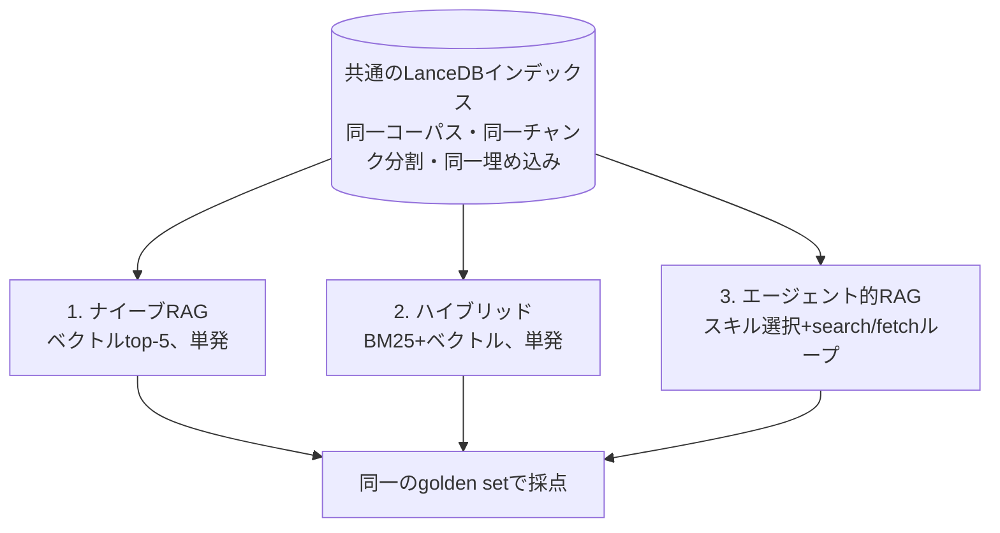

## TL;DR

- 自分のQiita記事20本をコーパスに、**ナイーブRAG / ハイブリッド検索 / エージェント的RAG** の3パターンを同一条件で比較した
- 結果は**エージェント化しても精度は上がらなかった**。同じ精度に**入力トークン25倍・レイテンシ8倍**を払っている
- ただし初回は「完敗」だった。原因を追うと**5つが実装バグと計測の交絡**で、潰したら単発ハイブリッドと同点まで上がった
- **「エージェント的RAGは効果がない」と結論する前に確認すべきこと**が、この記事の本題

## 対象読者

- RAGにエージェント的なループを入れるか迷っている人
- 日本語コーパスでRAGを組もうとしている人
- LLMを使った比較実験を、それらしい数字で終わらせたくない人

---

## なぜ3パターンに分けたか

「普通のRAGとエージェント的RAGを比較したい」という動機だったが、2択にすると
**改善したときにその原因が分からない**。エージェント化で良くなったのか、
検索器を良くしたから良くなったのか切り分けられない。

そこで3つに分けた。

| # | パターン | 検索 | ループ |
|---|---|---|---|
| 1 | ナイーブRAG | ベクトル top-5 | なし |
| 2 | ハイブリッド | BM25 + ベクトル（RRF融合）top-5 | なし |
| 3 | エージェント的RAG | ハイブリッド + スキル選択 + search/fetch ループ | あり |

- **1 → 2 の差** = 検索精度の改善による効果
- **2 → 3 の差** = エージェント化による効果（検索器は同一なので、差はループと判断のみ）



比較を成立させるため、以下を不変条件として固定した。

1. 3パターンは**同一のLanceDBインデックス**を共有する
2. **生成モデルとプロンプトは共通**（1箇所に定義して全パターンがimportする）
3. 埋め込みモデルは ingestion と検索で同一
4. 最終的にプロンプトへ入る根拠は **k=5 が上限**
5. 3パターンとも同一形状の結果を返す

構成は TypeScript + [Mastra](https://mastra.ai/)、ベクトルDBは LanceDB、
LLMと埋め込みは OpenAI（`gpt-5.6-luna` / `text-embedding-3-large`）。

---

## 結果

golden set 46問（後述）に対する完全ヒット率。

| | easy | multihop | 入力トークン | レイテンシ |
|---|---|---|---|---|
| ナイーブRAG | 19/20 | 13/26 | 1,591 | 2.8s |
| **ハイブリッド** | **20/20** | **17/26** | 1,620 | 3.0s |
| エージェント的RAG | 19/20 | 17/25 | **41,009** | **24.0s** |

- **1 → 2**（検索精度の改善）: multihop 13 → 17。**ハイブリッド検索は明確に効いた**
- **2 → 3**（エージェント化）: 17 → 17。**精度は変わらず、コストだけ25倍**

単発で足りる easy 領域では、6回の実験を通じてエージェント的RAGが単発を上回ったことは
**一度もなかった**。

これだけ見ると「エージェント的RAGは不要」で終わる。実際、最初はそう結論しかけた。

---

## 本題：その結論を出す前に潰すべきだった5つのこと

初回の結果は multihop **10/26** だった。単発ハイブリッドの17に対して完敗である。
そこから17まで上がったのだが、**7問ぶんの改善はすべて実装バグと計測の交絡の除去**で、
新機能は1つも足していない。

| 実行 | multihop | 変更内容 |
|---|---|---|
| (a) | 10/26 | ベースライン |
| (b) | 14/26 | k=5 という予算の存在をエージェントに伝えた |
| (c) | 12/26 | 充足チェックを収集段階へ（マージ順にバグ混入） |
| (d) | 10/26 | マージ順を修正 |
| (e) | 16/26 | 1手目を元の質問に固定 + 言い換え方針 + 計測バグ修正 |
| (f) | 17/25 | スニペット 200 → 500字 |

以下、順に説明する。

### 落とし穴1: 日本語BM25がデフォルト設定で死んでいる

これは実験を始める前に踏んだ。

LanceDB の全文検索は Tantivy ベースで、`baseTokenizer` のデフォルトは `simple`。
これは**空白と句読点で分割する**トークナイザなので、分かち書きしない日本語では
BM25 が機能しない。

合成データと実コーパスで測った。

| baseTokenizer | 合成データ | 実コーパス（記事20本） |
|---|---|---|
| `simple`（デフォルト） | **0/10 (0%)** | **4/25 (16%)** |
| `icu` | 10/10 | 23/25 (92%) |
| `ngram` (2-3) | 10/10 | 25/25 (100%) |

合成データで**全クエリがヒット0件**。実コーパスで16%まで上がるのは、
`LanceDB` `vLLM` のようなASCII語だけは空白区切りでもトークン化されるから。
つまり**日本語語彙はほぼ引けていない**。

```ts
await table.createIndex("text", {
  config: lancedb.Index.fts({ baseTokenizer: "icu" }),  // 明示が必須
});
```

厄介なのは**エラーも警告も出ない**こと。検索結果が空になるだけなので、
最終スコアを見ても原因に辿り着けない。デフォルトのまま進めていたら、
パターン2のBM25側の寄与はゼロで、「ハイブリッド検索は効果がない」という
誤った結論に着地していた。

`icu` を採用した（`ngram` は100%だが、これは「部分文字列検索が部分文字列を見つけた」という
ほぼ同語反復で、ランキング品質の証拠にはならないため）。

### 落とし穴2: LLMに作らせたgolden setは簡単すぎて天井に張り付く

評価用の質問セットを、各チャンクをLLMに渡して自動生成した。
正解 chunk_id が生成時点で自動的に紐づくのが利点である。

60問作って、生成を走らせず検索だけ測ったところ——

| | recall@5 |
|---|---|
| ベクトル検索 | 58/60 (97%) |
| ハイブリッド | **60/60 (100%)** |

**単発検索が満点**。これでは、エージェント化に改善の余地が構造的に存在しない。
このまま実験を回せば「ループはコストが増えるだけ」という結論が出るが、
それは*エージェント的RAGについての発見ではなく、golden setが簡単すぎることの反映*である。

原因ははっきりしている。**1つのチャンクから質問を作り、かつ主題を名指しさせた**ため、
その1チャンクと語彙・意味の両方がほぼ完全一致していた。

そこで**マルチホップ質問**を追加した。別記事にある2つのチャンクを組み合わせないと
答えられない質問である。ベクトル近傍を「別記事から」引いてペアを作り、
両方が必要な質問をLLMに作らせる。

| バケット | ベクトル | ハイブリッド |
|---|---|---|
| easy（1チャンク） | 95% | 100% |
| **multihop（2チャンク必須）** | 50% | **65%** |

multihop に35%の伸びしろができた。ここがエージェント化の主戦場になる。

なお、**検索でヒットするかどうかで質問を絞り込んではいけない**。
評価対象の検索器で評価データを選別することになり、全パターンのスコアが
実力以上に嵩上げされる（循環論法）。フィルタは質問文の性質だけを見る。

### 落とし穴3: エージェントに「予算」を伝えていなかった

k=5（プロンプトに入る根拠は最大5件）はコードで強制していたが、
**エージェントには伝えていなかった**。

結果、46問中33問で予算を使い切っていなかった（取得件数の分布は 1件×11, 2件×11, 3件×7,
4件×4, 5件×13）。単発パターンが常に5件取るのに対し、エージェントは1〜2件で切り上げる。

**recall@5 という網羅性の指標に対して、土俵が揃っていなかった。**
実際、ハイブリッドが正解しエージェントが外した15問のうち、**12問（80%）は取得5件未満**だった。

プロンプトに「回答生成に渡せる根拠は最大5件。満たない場合は枠が余ったまま進む」と
書き足しただけで、multihop は 10/26 → 14/26 に上がった。

興味深いのは、**平均取得件数は 2.93 → 3.17 とほとんど増えていない**こと。
件数が増えたから当たったのではなく、**取りに行く対象の選び方が変わった**。

エージェントに与える情報は、能力ではなく「自分が置かれた状況の理解」を変える。
実装上の制約を知らないままだと、エージェント単体では最適でも系全体では最適でない
判断をしてしまう。

### 落とし穴4: 片方のパターンだけが使う機能が、採点対象から漏れていた

これが一番たちが悪かった。

search/fetch を分離した設計で、fetch には「どこまで読むか」を選ぶ `scope` がある。

- `chunk_only` … そのチャンクのみ
- `with_neighbors` … 前後1チャンクを含む
- `whole_section` … 同じ見出しのセクション全体

問題は採点側。`retrieved_chunk_ids` に**fetch の起点チャンクしか記録していなかった**。

```ts
// バグ: 範囲拡張で実際に読んだ隣接チャンクが計上されない
retrieved_chunk_ids: docs.map((d) => d.chunk_id),
```

範囲拡張はエージェント的RAGだけが使う機能なので、
**エージェント側だけを一方的に減点していた**。

実例。「データ拡張手法をすべて挙げよ」という質問で、エージェントの回答は
「ランダム左右反転 / RandAugment / Cutout」と完全に正解だった。
しかし fetch の起点が `#4`、golden が `#3` だったため**不正解と採点**されていた。
`with_neighbors` で `#3` も本文として読んでいたのに、記録から漏れていたのである。

比較実験では、**片方のパターンだけが使う機能が採点対象から漏れていないか**を疑うこと。

### 落とし穴5: 確信度チェックを回答の「後」に置くとループが働かない

エージェント的RAGの肝は「根拠が足りなければ検索し直す」ループである。
ところが**ターン数の中央値が1**で、46問中25問が1回の検索で完結していた。
再検索という機能が事実上使われていない。

原因は確信度チェックの位置だった。当初は回答生成の**後**に置いていたのだが、
**一度回答文が生成されると、その流暢さが根拠の不足を覆い隠す**。
片方の文書しか取れていなくても、文章としては尤もらしく仕上がるため「十分」と判定される。

そこでチェックを**収集段階**に移し、**判定器に回答文を渡さない**ようにした。
質問と、集まった根拠と、これまでに試したクエリだけを見せる。

```
検索スキル
  ├─ search→fetch ループ
  ├─ 充足チェック（根拠のみを見る。回答文は渡さない）
  └─ 不足なら「何が足りないか」を添えて再収集
→ 回答生成
```

これでループは回るようになった（ターン数 1.9 → 2.9）。
「もう片方の文書が足りない」と言えるのは、回答文ではなく**根拠そのもの**を
見ているときだけである。

---

## 損失がどこで起きているかを測る

「エージェント化はコストが増えるだけ」と結論する前に、**どこで負けているのか**を測った。

エージェントは実際に投げたクエリをログに残しているので、損失を3段階に分解できる。
生成を走らせず埋め込みだけなので、**数十秒・ほぼ無料**で回る。

| 段階 | 修正前 | 修正後 |
|---|---|---|
| ① 元の質問そのまま @5（＝単発と同条件） | 80% | 80% |
| ② エージェントの言い換えクエリ @5 | 63% | 76% |
| ③ 同 @8（エージェントが実際に見た候補） | 76% | **82%** |
| ④ 実際に fetch した根拠（最終結果） | 67% | **80%** |

| 損失 | 修正前 | 修正後 |
|---|---|---|
| A. クエリ言い換えで失った | 4件 | **0件** |
| B. 見えていたのに取らなかった | 7件 | **4件** |

### 損失A: クエリの言い換えが検索を悪くしていた

エージェントは元の質問を捨て、同義語・関連語を**継ぎ足した**クエリを作っていた。

> 元:「vLLMのmax-model-lenを小さくすると速度が改善するのはなぜ？」
> 言い換え:「vLLM max-model-len を小さくすると推論速度が改善する理由 KV cache メモリ 使用量 スケジューリング 長いコンテキスト」

語の水増しは BM25 では一致度を薄め、ベクトルでは「質問文の意味」を「語の羅列」に変質させる。
**①80% → ②63% と、17ポイントも落ちていた。**

「クエリ整形は検索を良くする」という設計時の前提が、実測では成立していなかった。

対策は2つ。

1. **1ターン目の検索をコード側で実行する。** エージェントに「元の質問を使え」と
   指示するのではなく、元の質問での検索結果を渡した状態から開始する。
   言い換えは「1回目で足りなかったとき」の手段として2ターン目以降に回す
2. **言い換えは「足す」ではなく「置き換える」**とプロンプトに明記する。
   元の質問と同じ長さかそれ以下の、別の言い方の文にさせる

結果、損失Aは**0件**になり、クエリ長も「105字 → 105字」と水増しが止まった。

### 損失B: 200字のスニペットでは判断できない

search は本文を返さず200字のスニペットだけを返す設計だった。
エージェントがスニペットだけで回答を組み立ててしまうのを防ぐためである。

しかしこれが裏目に出て、**候補リストに正解が見えているのに fetch しない**ケースが7件あった。

```
正解chunkの順位:      1, 2, 3, 6, 6, 6, 6
そのとき取得した件数: 1, 1, 5, 3, 3, 5, 5
```

**3件は1〜3位に表示されていたのに取っていない**（うち2件は1件だけ取って打ち切り）。
200字では「この文書が本当に質問に答えているか」を判断できない。

スニペットを500字に厚くしたところ、損失Bは 7件 → **4件**に減った。

### その結果

最終的に、**エージェントが見ている候補は82%で、単発ハイブリッドの80%を上回った**。
検索そのものは、もうエージェント側の方が良い。
最終結果80%も単発と同水準である。

つまり**「エージェント化で情報を失っている」状態ではなくなった**。
修正前は4つの決定点すべてが正味マイナスだったが、
最後は検索で少し勝ち、選択で少し負けて差し引きゼロ、という状態である。

---

## 結論

### エージェント化は精度上のメリットを生まなかった

最終的に multihop は実質同点、easy はわずかに負け。
その一方で**入力トークン25倍、レイテンシ8倍**。

### 決定点の数がそのままリスクになる

単発ハイブリッドは**判断を一切しない**。生の質問を投げ、上位5件を機械的に渡す。決定点ゼロ。

エージェント的RAGは決定点を4つ持つ。クエリ書き換え、候補の取捨選択、読む範囲、十分性判定。
**そのすべてが情報を失いうる箇所**であり、実際に修正前は全部が正味マイナスだった。

エージェント化が報われるには、**決定点の数だけ発生する損失を上回る利得**が必要になる。
今回のコーパス（記事20本・455チャンク）と問題設定（2記事から1件ずつ）では、
単発top-5でも両方拾える余地が十分にあり、エージェントの出番が構造的に小さかった。

### 単発で足りる領域では、エージェント化は純粋なコスト増

easy バケットで agentic が hybrid を上回ったことは6回を通じて一度もない。
これは交絡の有無に関わらず成立した唯一の一貫した所見である。

**「まずハイブリッド検索をちゃんと作る」ほうが、費用対効果がはるかに良い**（1→2で13→17）。

---

## 正直に書いておく限界

### 分散を測っていない

各条件**1回ずつ**の実行である。エージェントは確率的に振る舞うので、
**2〜4問の差は誤差**。(a) 10 → (f) 17 という方向性は信頼できるが、
「(b) から (e) で+2問改善した」のような語り方はできない。

私はこれを最初に限界として認識しながら、**その後4回、単発の結果を根拠に設計変更を重ねた**。
途中で「マージ順のバグが原因」と因果を断定したが、修正しても改善せず、
仮説はデータに支持されなかった。順序が逆で、分散を測ってから改善に着手すべきだった。

### 規模とドメインが限定的

自分のQiita記事20本（vLLM・ローカルLLM・RAG構築が中心）という小規模コーパス。
数万文書規模、あるいは検索が本質的に難しいドメインでは結論が変わる可能性が高い。

### マルチホップの設計が限定的

「別記事の2チャンク」に限定している。3ホップ以上や、同一記事内の遠いセクション間などは
試していない。ホップ数が増えれば単発top-5では原理的に届かなくなり、
エージェント化の利得が出る可能性がある。

---

## まとめ

「エージェント的RAGは効果がなかった」という結論自体は、たぶん多くの人が
同じ実験をすれば得られる。この記事で書きたかったのは**その手前**である。

初回の「完敗」は、エージェント的RAGではなく**実装の質を測っていた**。
5つの落とし穴を潰したら、同じコードベースが 10/26 から 17/25 になった。

比較実験でネガティブな結果が出たとき、
**それが対象の性質なのか自分の実装なのかを切り分ける**手段を持っておくこと。
損失の段階分解は、そのための道具として実際に機能した。

コードは全部 GitHub に置いてある（実験ログ6本とADR9本つき）。

<!-- TODO: リポジトリURL -->
