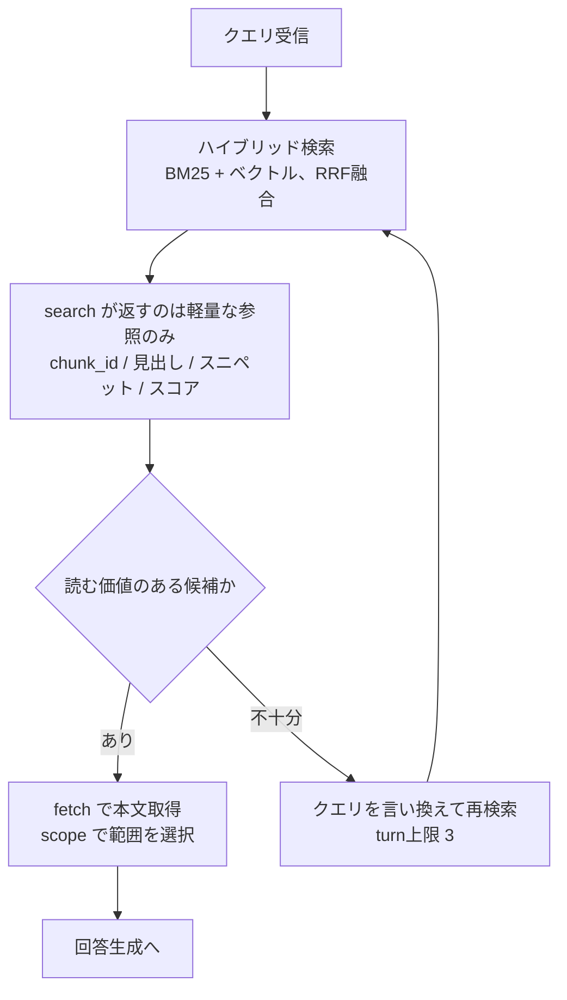

# search / fetch の内部処理

検索スキルの内部を search（探索）と fetch（取得）に分離した構成の詳細。
分離を選んだ判断の経緯は `decisions/0003-search-fetch-separation.md` を参照。

## 全体の位置づけ



## 前提: 整形は ingestion 時に完了している

fetch はノイズ除去を行わない。整形は `src/index/clean.ts` でインデックス構築時に
一度だけ済ませてある（`decisions/0004-cleaning-at-ingestion.md`）。
fetch の責務は結合・重複除去・メタデータ付与・予算管理に限定される。

## search（探索）

`src/search/hybrid-search.ts`

### 1. インデックス問い合わせ

BM25（全文検索）とベクトル検索の両方を投げ、RRF（Reciprocal Rank Fusion）で融合する。

```ts
const results = await table.query()
  .fullTextSearch(query)
  .nearestTo(queryVector)
  .rerank(reranker)   // RRFReranker
  .limit(k)
  .toArray();
```

TypeScript SDK には Python の `.vector()/.text()` パターンがなく、
埋め込みを自前で計算して `.nearestTo()` に渡す必要がある。

> **RRF はリランクではない。** 名前に Reranker が付くが、これは順位の統計的融合であって
> Cross-Encoder による意味的な再スコアリングではない。後者は今回導入していない
> （`decisions/0005-no-cross-encoder-rerank.md`）。

### 2. 軽量な返却

返すのは `chunk_id`・タイトル・見出しパス・スニペット（先頭200字）・スコアのみ。
**本文は返さない。**

ここで本文まで返すと、エージェントが fetch を呼ばずスニペットだけで判断してしまい、
分離した意味が消える。スニペット長 `SNIPPET_CHARS` を短く保つことが、
この設計が機能するための前提になっている。

### 3. 再検索の判断材料

スコアが全体的に低い、あるいは件数が少ない場合、それ自体が
「クエリの言い換えが必要」というシグナルになる。ツールの description に
その旨を書いてエージェントに判断させている。

## fetch（取得）

`src/search/fetch.ts`

### 1. ID から実体を引く

`chunk_id` を受け取り、LanceDB から本文を引き当てる。

### 2. 取得範囲の決定（scope）

エージェントが選ぶ。ここが分離型の中核。

| scope | 内容 | 使いどころ |
|---|---|---|
| `chunk_only` | そのチャンクのみ | 単一の事実を確認したいとき |
| `with_neighbors` | 前後1チャンクを含む | 記述が境界にまたがっていそうなとき |
| `whole_section` | 同じ `heading_path` のチャンク全体 | 章単位で読みたいとき |

`heading_path`（例: `記事タイトル > セットアップ > Docker`）を各チャンクに
メタデータとして持たせてあり、これが範囲拡張の単位になる。

### 3. 結合・重複除去

複数の seed が同じ範囲に展開されることがあるため、fetch 全体で重複チャンクを排除する。
`included_chunk_ids` に実際に結合された chunk_id が入るので、後から検証できる。

### 4. 引用用メタデータの付与

出典（記事タイトル・URL・見出しパス・更新日）を本文とセットで返し、
最終的な回答生成での引用表示に使う。

### 5. キャッシュ

`FetchCache` により、同一ループ内で同じ chunk を再取得しない。
**1回の実行（1質問）ごとにインスタンスを作る。** プロセス全体で共有すると
質問間で状態が漏れ、評価を並列実行した瞬間に壊れる。

### 6. コンテキスト予算の管理

取得した本文の合計が上限（既定6000文字）を超える場合、検索順位の高いものから詰め、
溢れる分を切り詰める。省略注記の長さも予算の内側に収めてある。

## 3パターンでの使われ方

| | search | fetch |
|---|---|---|
| ナイーブRAG | ベクトル top-5 | `chunk_only` 固定 |
| ハイブリッド | ハイブリッド top-5 | `chunk_only` 固定 |
| エージェント的RAG | ハイブリッド top-8、ループ内で複数回 | **エージェントが scope を選択** |

パターン1・2も fetch を通している。本文取得の経路を3パターンで共通にすることで、
差分が「どのチャンクを選んだか」と「ループの有無」だけに限定される。
